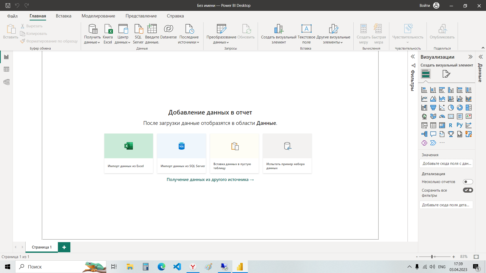

## Урок 1. Из каких этапов состоит подготовка отчета

### Распишите подробнее свой путь в аналитике и ожидания от обучения:
- Есть ли у вас опыт в аналитике и сколько лет?
    - нет 

- В каком направлении анализа планируете развиваться: BI, бизнес, финансовый, маркетинговый, HR, системный, продуктовая?
    - пока незнаю учусь на ИИ

- Возможно вы руководитель или владелец бизнеса, тогда распишите как поможет аналитика в ваших задачах.
    - не руководитель

- Какие основные навыки вы хотите освоить?
    - нужно общее понимание

- Есть ли у вас уже опыт работы в какой-то BI-системе и если да, то какой?
    - не было 